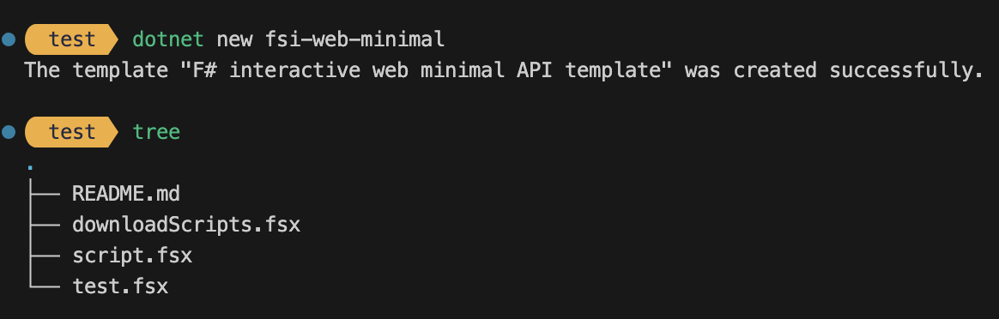

# F# interactive minimal web api template (.fsx) 🦔


The `fsi-web-minimal` .NET template can be used to generate F# minimal API apps using only .fsx scripts, without a full `.fsproj`, but only with `.fsx` files.
An utility html dsl view engine [Feliz.ViewEngine](https://github.com/dbrattli/Feliz.ViewEngine) is provided as a dependency, but can be removed or replaced with other view engines.

Waiting for the official [F# mascotte announcement](https://sergeytihon.com/2024/03/02/f-weekly-9-2024-should-hedgehog-be-an-official-f-mascot/) yet.

## installation

```
cd working/content
dotnet new install .
dotnet new fsi-web-minimal
```

you should get a directory structure like the one below (same as `test` folder).



## Run

run the download script
`dotnet fsi downloadScripts.fsx`

then run 
`dotnet fsi generate-sdk-references.fsx`

then to run the app make sure you have installed NET8 SDK LTS,
then run to start the server, listening to port 5000.
`dotnet fsi script.fsx`

## OpenApi

navigate to `http://localhost:5000/swagger` to check the OpenApi spec

## Testing 

to live test the api, download the openapi spec while your app is running, for convenience the `test.fsx` script includes also such utility function, remember to run this script your server must be running and serving the openapi/swagger metadata, it won't work if you didn't start your script yet.

`dotnet fsi test.fsx --update-openapi`

then normally run the test `dotnet fsi test.fsx` 

the test is performed against the OpenApi contract using the awesome [SwaggerProvider](https://fsprojects.github.io/SwaggerProvider/#/)
you should see in your server terminal window the endpoints being hit, and you will get a print result for your test endpoint invocation.

### DevContainer and DOCKER

TBD, is possible obviously to run these commands in DOCKER just using the microsoft dotnet-sdk image, that also includes `dotnet fsi` as command.

### Why

The convenience of a single script app makes it possible for F# to shine as a great language for microservices. All well isolated and testable, from the public openapi a clear contract specification, a monorepo or many repos you can decide for your own. 

